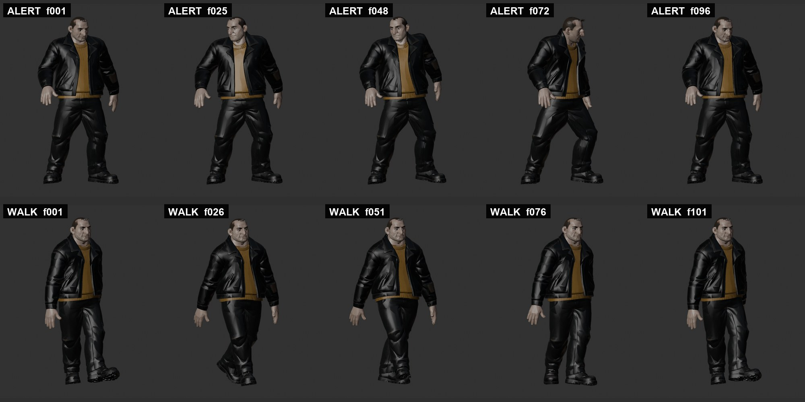
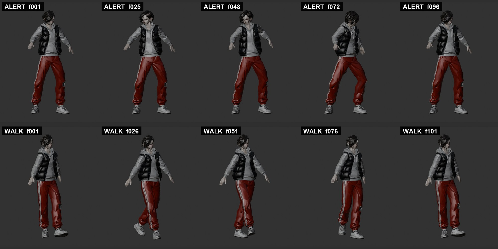

# Meshy fighter pilot results

> **Current status (2026-09-12):** F01/F02 v05 are registered and deployed in the isolated C.03 fight module. Production lifecycle remains RIGGED. See [assets/asset_manifest.json](assets/asset_manifest.json) for exact candidate hashes and outstanding gates, and [3D_PIPELINE.md](3D_PIPELINE.md) for the repeatable service plan. The original run record below is historical; its no-integration/no-public-GLB statements no longer describe the current candidates.

- Pilot run: 2026-09-11–12 (America/Los_Angeles)
- Lane: Art
- Current state: **rigged review candidates; not runtime-registered, deployed, or game-ready**

This is the receiving-agent completion record requested by
[MESHY_AGENT_HANDOFF.md](MESHY_AGENT_HANDOFF.md). It records the exact approved
sources, paid Meshy task chain, private-output fingerprints, Blender inspection,
and the gates that remain. Generated GLBs and working files remain private.

## Owner scope

The owner approved the two supplied concepts and identified them as the only new
poses. The owner then ordered both pilot generations. In the follow-up on
[PR #68](https://github.com/mbace1/piritori-eden/pull/68), the owner explicitly
authorized both existing masters through a 15,000-triangle-target remesh,
defect review, texturing, rigging, joint-deformation checks, idle, and walk.
The same direction says F01's A-pose is acceptable when deformation works.

That authorization does **not** mean final runtime approval:

- F01 and F02 source concepts remain owner-approved.
- The derivative pipeline below is complete and provisionally passes local
  rig/animation QA, but still needs owner visual review.
- No runtime manifest registration, game integration, deployment, or additional
  Image-to-3D generation was authorized or performed.
- Raw masters, derivative GLBs, FBXs, Blender files, and detailed QA reports are
  retained only in the ignored private workspace.

## Source references

| Pilot | Repository source | Dimensions | SHA-256 |
|---|---|---:|---|
| F01 heavy bruiser | [`f01-heavy-bruiser-tpose-v01.jpg`](art-library/characters/concepts-3d/pilots/f01-heavy-bruiser-tpose-v01.jpg) | 1280 × 1067 | `75B02CB98746F19AA3ACF664A54591D9CDAEADD9B4CD456DBE021117EA029D87` |
| F02 wiry skirmisher | [`f02-wiry-skirmisher-tpose-v01.jpg`](art-library/characters/concepts-3d/pilots/f02-wiry-skirmisher-tpose-v01.jpg) | 853 × 1280 | `E7FBF7C927FAF4277757AB6BE6458A8ADFFDBAAAADCC3805AC12CFAC42329587` |

The earlier private F01 PNG provenance hash is
`BC02611151B0D7BB255F899741953ACC5C8BA5D88E597B43D9595E46D720C26C`.
The received chat attachment is a JPEG and is not byte-identical; the JPEG hash
above is the source-of-truth fingerprint for this run.

## Completed Meshy chain

The executed chain was:

`approved JPEG → geometry-only master → 15k remesh → 2k retexture → rig → Alert + Casual Walk`

The original geometry calls used Meshy-7, `standard`, `pose_mode: "t-pose"`,
`should_texture: false`, and `should_remesh: false`. The original masters were
therefore preserved before creating derivatives.

| Pilot | Image-to-3D task | Remesh task | Retexture task | Rig task |
|---|---|---|---|---|
| F01 | `01a0928b-41b6-754b-b075-8024d416e00b` | `01a0940b-dcfb-74c5-8893-8c30330fb84b` | `01a09424-95a8-73ba-b4f1-7d9f3bcdd7f9` | `01a09426-1412-70e8-ad48-a521dbd78601` |
| F02 | `01a0928b-4621-73da-8948-b8a8201cfc5e` | `01a0940c-8947-779c-9178-af19ab6f8ade` | `01a09425-21f8-7461-af82-bfdc1ad68820` | `01a09426-defb-740f-8ddb-a6a2b50a693c` |

Remesh used triangle topology with `target_polycount: 15000`. Retexture used the
approved source as `image_style_url`, Meshy-7, the original remesh UVs, a 2k
texture, and no PBR maps. Rigging received the textured derivative by
`model_url` at a declared 1.9 m height; the raw multi-million-triangle task was
never used as the rig input.

| Pilot | Clip | Action ID | Animation task | Frames at 30 fps |
|---|---|---:|---|---:|
| F01 | Alert / purposeful idle | 2 | `01a09428-6eb7-727a-9fe9-0daadeb0e7e3` | 1–96 |
| F01 | Casual Walk | 30 | `01a09428-de23-74ab-8671-b0876b34b013` | 1–101 |
| F02 | Alert / purposeful idle | 2 | `01a09429-2aaf-7379-be74-926dd4b71752` | 1–96 |
| F02 | Casual Walk | 30 | `01a09429-9848-714b-bb97-e43af717ee1c` | 1–101 |

### Credit record

| Stage | F01 | F02 | Total |
|---|---:|---:|---:|
| Image-to-3D masters | 20 | 20 | 40 |
| 15k remesh | 5 | 5 | 10 |
| 2k retexture | 10 | 10 | 20 |
| Rigging | 5 | 5 | 10 |
| Two animation actions | 6 | 6 | 12 |
| **Cumulative** | **46** | **46** | **92** |

No API key, account balance, billing identifier, or temporary download URL is
committed.

## Private output fingerprints

These filenames are identifiers for the ignored private workspace, not public
download links.

| Pilot / stage | Private GLB filename | Bytes | SHA-256 |
|---|---|---:|---|
| F01 master | `F01-heavy-bruiser-meshy7-geometry.glb` | 35,036,376 | `41C221ABBA1108E65BC9C1C128BF2EE8B3C5AA3D73DD8B0C1F60C050D7E723DB` |
| F01 remesh | `F01-heavy-bruiser-remesh-15k.glb` | 635,052 | `82AB273B365BD2483F1ED964F0BCFD29102AAEE10BD6E4704EBA088C0E55BFCC` |
| F01 textured | `F01-heavy-bruiser-textured-2k.glb` | 3,966,016 | `E92CE303E1064AD2E88ADF26CCBDB17E80C22444E747ED2C7C6DCB79807298FE` |
| F01 rigged | `F01-heavy-bruiser-rigged.glb` | 7,794,708 | `9FDDB141D5D1CDE397D3EB7256FA3B9BD900BE5F192B74AA59FFA382D4781229` |
| F01 Alert | `F01-heavy-bruiser-alert-idle.glb` | 7,839,836 | `5508A8148A795CFD128FEE199DB33E6DAB8BEA2ACB116DD46F2930ABBC8674E4` |
| F01 Casual Walk | `F01-heavy-bruiser-casual-walk.glb` | 7,842,048 | `C29208E194B93EEEFA672F67A9737273734A05928970494F0B4B2B8923E1BA35` |
| F02 master | `F02-wiry-skirmisher-meshy7-geometry.glb` | 35,529,492 | `B35A2730D4E1BC9B731D3DAD39E9CE4116838F9B39601B067C73DE0D4771E8B7` |
| F02 remesh | `F02-wiry-skirmisher-remesh-15k.glb` | 846,040 | `0FCC11D2B838ACB3E3576BE92D98953652C95203812438C5F01ED33826495542` |
| F02 textured | `F02-wiry-skirmisher-textured-2k.glb` | 4,574,844 | `057703D9DBB205F17AB04FE7FFB181A175EF5C36121449F387B0871A9445D703` |
| F02 rigged | `F02-wiry-skirmisher-rigged.glb` | 7,733,816 | `A77AF2632553DCBEADAC3573C4FE357F0556211F09E55D926CF19F1240EF355E` |
| F02 Alert | `F02-wiry-skirmisher-alert-idle.glb` | 7,780,360 | `CBA40745E833FAE4D7F3E6CCFDDE4A89FCC91A6634E602777A1B58EFC968E3B2` |
| F02 Casual Walk | `F02-wiry-skirmisher-casual-walk.glb` | 7,782,668 | `5C11E34D022FC3FE642387276B1FF85C7F237C0D876E9799981965CF915482E7` |

Meshy's rig task also returned basic-walking and basic-running GLBs plus FBX
versions. They are retained privately; the requested Alert and Casual Walk GLBs
were the clips used for this review.

## Blender 5.2.1 remesh inspection

| Check | F01 heavy bruiser | F02 wiry skirmisher |
|---|---|---|
| Dimensions X × Y × Z | 1.7479 × 0.4797 × 1.9021 m | 1.5543 × 0.3481 × 1.9010 m |
| Actual triangles | **15,512** | **15,503** |
| Pose | A-pose retained; owner said this is not a hold if deformation works | Horizontal T-pose retained |
| Silhouette / identity | Broad jacketed bruiser, face, hands, trousers, and boots remain readable | Lean padded-vest silhouette, hair, face, hands, striped trousers, and trainers remain readable |

GLB import initially reports many boundary edges because the export splits
vertices at UV/normal seams. An exact positional weld made no geometric move,
changed no triangles, and reduced the diagnostic topology to:

| Diagnostic after exact weld | F01 | F02 |
|---|---:|---:|
| Vertices | 7,754 | 7,605 |
| Boundary edges | 33 | 144 |
| Overfull junction edges | 28 | 158 |
| Bounds change | 0 | 0 |

The original F02 master's isolated three-edge, approximately 1 mm closed hole
does not recur: after remesh/weld there are no closed hole loops eligible for a
tiny-hole fill. The remaining edges are garment/body junction topology rather
than nearly coincident cracks; tolerances from 10–250 μm made no further change.
No crack, webbing, missing limb, or silhouette break is visible in the renders.

A private 3 mm voxel-remesh experiment became internally manifold but slightly
smoothed the models, and its GLB reimport dropped faces. It was rejected. The
successful Meshy remesh tasks—not the rejected voxel tests or raw masters—fed
retexture and rigging. The residual junction counts remain documented as a
runtime-import caveat rather than being misreported as fully manifold.

## Rig and animation QA

Both delivered clips have:

- one skinned character mesh;
- one 24-bone deform armature and 24 matching vertex groups;
- normalized weights, no unweighted vertices, and at most four influences per
  vertex;
- one packed 2048 × 2048 texture;
- no NaN or infinite evaluated vertex coordinates at any sampled frame.

The basic skeleton has no finger bones. Hand silhouettes are preserved, but
individual finger articulation is not part of this rig.

Five frames were rendered from each Alert clip (`1, 25, 48, 72, 96`) and each
Casual Walk clip (`1, 26, 51, 76, 101`). Shoulder, elbow, hip, and knee motion is
coherent for both pilots. Identity and colour blocking remain readable; no
visible tearing or decisive self-intersection occurs. The vest/hoodie on F02
does not punch through at the shoulders. Both pilots show ordinary low-poly
cloth pinching around the crotch and knees during the walk, but it is not a
pilot-blocking failure.

Automated triangle-area comparison found only isolated outliers—at most three
of roughly 15.5k faces in a sample below 0.2× reference area, and only F01 had a
single face above 5×. None corresponds to a visible tear in the sampled renders.

Each Meshy rig/animation GLB also includes an unskinned 42-vertex object named
`Icosphere`. It is not part of the character and must be stripped during runtime
staging.

### Visual evidence

The committed sheets are compressed review evidence only; source renders and
per-frame JSON reports remain private.

## Decision and remaining gates

- **F01 — provisional rig/animation pass.** The A-pose did not prevent a
  functional rig. Face, hands, jacket silhouette, and lower-body deformation
  remain readable through Alert and Casual Walk.
- **F02 — provisional rig/animation pass.** The T-pose produced a functional
  rig; vest/hoodie, track-trouser silhouette, shoulders, hips, and knees survive
  the sampled clips.

Before either becomes runtime art:

1. the owner must review the textured identities and motion sheets;
2. strip the helper Icosphere and create/validate a 1k runtime texture derivative;
3. decide whether the documented junction topology is acceptable to the actual
   importer, or repair and revalidate it if the importer exposes a failure;
4. integrate idle/walk/stop/turn in an explicitly authorized runtime step;
5. measure download, memory, and animation behavior on Pixel 10 Pro and iPad M2;
6. only then register production GLBs in the runtime manifest and deploy.

## Official references checked

- <https://docs.meshy.ai/en/api/image-to-3d>
- <https://docs.meshy.ai/en/api/remesh>
- <https://docs.meshy.ai/en/api/retexture>
- <https://docs.meshy.ai/en/api/rigging>
- <https://docs.meshy.ai/en/api/animation>
- <https://docs.meshy.ai/en/api/animation-library>
- <https://docs.meshy.ai/en/api/pricing>
