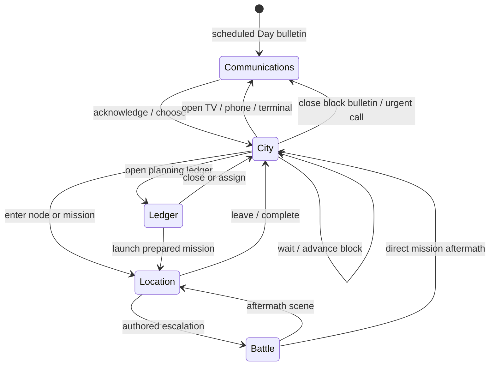

# Piritori → Eden — UX specification

Version: 1.0  
Date: 2026-08-19  
Status: **ACTIVE — five-mode interaction and responsive-layout authority**  
Primary target: mobile browser, landscape and desktop supported  

This document translates the GDD, design locks and Art Bible into a navigable
product. It defines information architecture, interaction, state transitions
and responsive composition. It does not set final art assets, story copy,
economy balance or exact map coordinates.

Companion wireframes:

- `ux/five-modes-landscape.svg`
- `ux/five-modes-portrait.svg`

The wireframes show hierarchy and reflow only. The active visual treatment is
`ART_BIBLE.md`.

---

## 1. UX promise

At any moment the player should understand:

1. **where attention is focused;**
2. **what can be done now;**
3. **what the action will consume;**
4. **what is known, uncertain or hidden;**
5. **which person or place makes the action possible;**
6. **how the result returned to the city.**

The UX must make a complex network feel legible without turning the game into a
modern finance app. Planning surfaces are folders, map layers, quote cards and
physical devices from 2003. Location and battle surfaces feel entered.

### Non-goals

- one dashboard containing the whole game;
- a permanent phone-app shell;
- nested modal windows;
- hover-only explanation;
- hidden action costs;
- tiny icon-only commands;
- long dialogue over a static card with no location interaction;
- a free-roaming tactical grid;
- exact live information without a person or place supplying it.

---

## 2. Target viewports and density

Design and test these anchors:

| Class | Reference viewport | Layout use |
|---|---:|---|
| compact portrait | 360 × 640 | minimum supported phone |
| primary portrait | 390 × 844 | default mobile composition |
| large portrait | 430 × 932 | expanded mobile spacing |
| compact landscape | 844 × 390 | rotated phone; short world window |
| primary landscape | 1366 × 768 | laptop/tablet landscape |
| full landscape | 1920 × 1080 | art master and desktop |

Rules:

- **44 CSS px is the hard minimum touch target; 48 px is preferred.**
- Minimum body text is 16 CSS px on compact portrait unless user scaling makes
  it larger.
- No layout assumes hover, precision pointer or right click.
- Safe-area insets belong to layout code.
- Orientation can change at any non-combat decision boundary without losing
  selection or scroll position.
- During battle, orientation change pauses before reflow.

---

## 3. Information architecture

### 3.1 The five modes

| Mode | Player job | Entry | Exit |
|---|---|---|---|
| City | read flow, select node/mission, plan assignment | day start, location return, battle return | location, ledger, communications, wait |
| Location | meet, inspect, talk, use service, choose | node or mission arrival | city, battle, consequence |
| Ledger | compare market, crew, loadout and obligations | earned home/office shortcut or physical ledger | city or prepared mission |
| Battle | resolve a contested mission through formation choices | authored escalation | consequence then location/city |
| Communications | receive TV, SMS/call and desktop information | scheduled bulletin, message, accessible terminal | city or linked location/mission |

These are full interaction modes, not five permanent bottom tabs.

### 3.2 Planning versus committed context

**Planning context:** City, Ledger and Communications when no urgent scene is
blocking. The global shell is visible and the player may switch between
available planning modes without advancing time.

**Committed context:** Location and Battle. The global shell contracts to a
small status strip; switching to unrelated modes is disabled until the player
leaves, resolves or explicitly withdraws.

### 3.3 Navigation model

The planning dock contains:

- **CITY** — always available;
- **LEDGER** — locked until the first sale and physical ledger unlock;
- **MESSAGES** — available after the first phone/TV event, with unread badge;
- **MENU** — save, accessibility, language, controls and quit.

`WAIT / CLOSE BLOCK` is an explicit City action beside the clock, not a primary
navigation tab. Crew, loadout, market and obligations are sections within the
Ledger. TV, phone and online are channels within Communications.

Location uses **LEAVE**. Battle uses **WITHDRAW** or mission-resolution exits.

### 3.4 Global status strip

The planning status strip shows only:

- `DAY NN · DAY/EVENING/NIGHT`;
- current place or map focus;
- euro cash;
- separate markka balance when nonzero;
- debt due and next settlement;
- one urgent obligation or deadline indicator.

Crew condition, stock, pressure and market detail live in their modes. A small
badge may signal change; the strip does not become a second ledger.

In committed context, show time block, cash and the current mission/scene only.

---

## 4. State and transition model



### Transition rules

- One blocking mode at a time.
- A consequence recap appears as an attached strip inside the destination mode,
  not as a separate sixth mode.
- Time advances only after the committed action is confirmed and resolved.
- Reading, comparing, changing accessibility, changing language and backing out
  before confirmation do not advance time.
- A battle consumes its parent mission's block; it never charges another.
- Back returns to the prior meaningful state and selection. It never skips a
  consequence or silently cancels a paid commitment.

---

## 5. Shared component language

### 5.1 Paper panels

Components follow the Art Bible's nested paper construction:

- dark backing;
- light face or content area;
- coloured role/status tab;
- optional selected lift.

Hit regions stay rectangular even when visible edges are torn.

### 5.2 State vocabulary

| State | Visual and text treatment |
|---|---|
| available | full colour, command label, no badge |
| selected | lifted face, strong border/tab, explicit `SELECTED` for assistive copy |
| focused | clean visible focus ring independent of selected state |
| new | folded corner plus `NEW`/unread count |
| urgent | orange/red tab, deadline text and restrained pulse unless reduced motion |
| uncertain | mustard, broken border/line and `RUMOUR` or range label |
| locked | grey seal, requirement text and no false button affordance |
| unavailable now | dimmed face, opening/time reason and next availability |
| destructive/lethal | red edge, consequence sentence and second confirmation |

### 5.3 Consequence strip

After an action, show three layers in order:

1. one-sentence outcome;
2. two to four changed state chips;
3. visible world change highlighted in the returned mode.

Example:

`The seller remembers the refusal.`  
`SELLER: GUARDED · TIME: NIGHT · NEW RUMOUR`  
Then the Piritori node gains a guarded contact tab and the new rumour appears
on the map.

Do not dump unchanged currencies or every hidden calculation.

### 5.4 Confirmation levels

| Level | Use | Pattern |
|---|---|---|
| immediate | reversible selection, inspect, compare, equip before launch | one tap |
| commit | trade, travel, accept mission, spend block | action summary + confirm |
| severe | firearm escalation, lethal exposure, abandonment, large irreversible wager | explicit consequence sentence + hold or second tap |

---

## 6. Mode I — City operations map

### 6.1 Job

Show ordinary movement, hidden assignments, active missions and local change on
one compressed Kallio screen. Let the player focus a node, inspect an event and
prepare a route without turning the map into a market table.

### 6.2 Landscape layout

- Full-height relief map occupies roughly 72–78 percent of width.
- A right mission/focus rail occupies 22–28 percent when a node is selected.
- Status strip spans the top.
- Planning dock spans the bottom of the map and rail.
- The complete compressed Kallio boundary remains visible; focus may magnify a
  local area up to 1.35× without losing an overview inset.
- An unselected state uses the rail for changed nodes, expiring missions and the
  current crew assignment.

### 6.3 Portrait layout

- Status strip: compact two rows.
- Map fills the central world window, favouring the approved tall relief-map
  composition.
- A selected node opens a bottom sheet attached by a stalk/line to its pin.
- The sheet has a collapsed and expanded stop; it never covers the selected pin.
- Planning dock remains at the bottom with four equal targets.
- The map fits the full boundary by default. One-finger pan is enabled only
  after explicit zoom; `FIT MAP` returns instantly.

### 6.4 Map layers and controls

Priority from back to front:

1. geography and districts;
2. ordinary flow;
3. crew assignments and goods return;
4. local pressure/closure;
5. missions and contacts;
6. selection and route preview;
7. focus rail/sheet and global shell.

Controls:

- tap node: select and open attached summary;
- tap moving person/crew: inspect assignment without stopping time;
- tap mission badge: focus mission tab;
- `PLAN ROUTE`: enter accessible route builder;
- `ENTER`: commit to a location/mission after preview;
- `FIT MAP`: reset view;
- `LAYERS`: choose ordinary flow, crew, missions or pressure emphasis;
- `WAIT`: advance deliberately after warning about expiring items.

### 6.5 Route builder

Route building supports touch and keyboard without requiring drag precision:

1. choose crew/person;
2. choose origin;
3. choose destination;
4. optionally choose one known waypoint;
5. review time, capacity, quote age, local pressure and mission deadline;
6. confirm assignment.

Dragging from node to node is a shortcut, not the only method. Invalid
connections explain why they fail. The preview uses the same city edges as
ordinary traffic and shows the predicted shared-capacity load.

### 6.6 Node summary

Collapsed summary:

- place/name;
- open/closed and next change;
- dominant known state;
- one urgent mission/contact badge;
- `ENTER` or requirement.

Expanded summary may show known services, current crew and rumour/range/quote
age. It does not show the full catalogue, roster or conversation.

### 6.7 Acceptance gates

- full map fits at 360 × 640 and 1366 × 768;
- selected pin remains visible with its sheet/rail open;
- ordinary and hidden flow are distinguishable without colour;
- route preview shows time and capacity before commit;
- no market table or long dialogue appears on the map;
- focus returns to the changed node after every consequence;
- map is operable without drag, pinch or hover.

---

## 7. Mode II — Location encounter

### 7.1 Job

Stage a readable place with people, objects, choices and memory. The player can
look, talk, use and leave, while earned services appear as contextual actions.

### 7.2 Landscape layout

- Scene occupies the upper 68–74 percent.
- Location title and time sit on a small top-left paper label.
- Speaking character/selected object receives a subtle stage focus, not a modal
  portrait takeover.
- Dialogue deck occupies the lower left/centre.
- Persistent verbs form a short edge row.
- Two to four contextual choice cards sit beside or below the dialogue deck.
- Costs, odds and known consequences appear inside the choice card before
  confirmation.

### 7.3 Portrait layout

- Crop the same scene around the speaking person and current object.
- Scene occupies 42–52 percent of height.
- Speaker strip and dialogue sit immediately below it.
- Persistent verbs form a four-target row.
- Contextual choices stack below, with the primary choice reachable one-handed.
- Long copy scrolls inside the dialogue region; the scene and current choice
  remain visible.

### 7.4 Interaction grammar

Persistent verbs:

- **LOOK** highlights readable hotspots and opens a labelled object/person list
  for nonvisual access;
- **TALK** selects a person or continues the current conversation;
- **USE** selects an object, carried item or service target;
- **LEAVE** returns to City after warning about unresolved commitments.

Contextual actions use concrete language: `BUY INFO`, `ASK FOR WORK`, `CONVERT
MARKKA`, `RISK SABOTAGE`, `ACCEPT`, `REFUSE`.

Directly tapping a person may default to TALK; tapping an object may default to
LOOK. The verb row always reveals and changes that default.

### 7.5 Hotspots

- No hotspot smaller than 44 × 44 CSS px.
- LOOK mode outlines all actionable regions and labels them.
- Overlapping hotspots open a small labelled chooser.
- Decorative objects do not masquerade as actions.
- Once an inspection is exhausted, its marker changes rather than demanding
  repeated taps.

### 7.6 Choice cards

Each card can show:

- action label;
- cash, favour, item or time cost;
- known success chance/risk band;
- person supplying the opportunity;
- relationship tone;
- severe consequence warning.

Unknown information is marked unknown; the UI never invents exact odds.

### 7.7 Toko instance application

Landscape keeps the counter as the stage, Toko centred behind it, night tram at
the right and three equal contextual cards beneath dialogue. Persistent verbs
remain available as a compact row or corner deck.

Portrait crops the outer lantern/tram edges first, keeps Toko's mask, hands,
bowl and till readable, places dialogue below the counter, then stacks `BUY
INFO`, `RISK SABOTAGE` and `LEAVE`. Costs and chance remain dynamic text.

### 7.8 Acceptance gates

- person, important object and exits read without pixel hunting;
- persistent verbs remain reachable at every narrative step;
- all contextual choices fit together or clearly indicate additional choices;
- known cost/risk appears before commit;
- refusing the first purchase branches forward and returns within two days;
- dynamic copy and controls are not baked into production art;
- keyboard/screen-reader object list mirrors visual hotspots.

---

## 8. Mode III — Ledger, crew and loadout

### 8.1 Job

Compare scarce resources and prepare commitments after access has been earned
through people and places. This is Aatami's physical ledger at home/office, not
a market-anywhere phone app.

### 8.2 Sections

The mode contains four persistent sections:

- **MARKET** — known offers, quote age and stock;
- **CREW** — availability, condition, wage and relationship behaviour;
- **LOADOUT** — mission deployment, role, armour and held-object reach;
- **OBLIGATIONS** — debt, wages, treatment, favours, deadlines and exit fund.

The section tab and title remain visible while content changes.

### 8.3 Landscape layout

- Left column: section list and filters, 18–22 percent.
- Centre: primary comparison table/cards, 46–54 percent.
- Right: selected detail, capacity/risk preview and commitment, 26–32 percent.
- Status strip remains visible.
- Selection in the centre updates the right panel without shifting page
  position.

### 8.4 Portrait layout

- Sticky status strip and four horizontal section tabs.
- Primary list fills the page.
- Selecting a row opens a bottom detail sheet with a clear compare/commit step.
- Comparison supports pinning up to two offers or crew cards.
- Market, Crew and Loadout never shrink into three simultaneous columns.
- Back closes detail sheet before leaving the Ledger.

### 8.5 Market information

Each offer shows:

- place/contact;
- good name and abstract units;
- buy/sell direction;
- rumour, range or exact quote;
- quote age;
- access/opening state;
- recent dominant cause of change;
- owned/capacity context.

The slice shows piri only. The UI contains no dose, effect, concealment or use
information.

### 8.6 Trade flow

1. select known offer;
2. inspect quote confidence and source;
3. choose abstract unit amount;
4. review cash, stock, capacity and destination requirement;
5. confirm or create a route/visit plan.

An exact transaction still occurs through an accessible person/place. The
ledger may prepare it; it cannot teleport the purchase.

### 8.7 Crew cards

Show:

- name and portrait;
- role and two readable capability cues;
- available / assigned / injured / unavailable;
- condition and wounds;
- wage/treatment need;
- equipment silhouette;
- behavioural relationship phrase, not one loyalty percentage;
- current route or last consequence.

Named people do not become faceless stat rows. A death, departure or absence
leaves a changed slot/history entry rather than silently removing the card.

### 8.8 Loadout

- Default deployment is three; hard cap four after the slice.
- Formation preview shows front/middle/back and three lanes without presenting
  a free-movement map.
- Weapon reach uses row/lane diagrams and words, not mechanical diagrams.
- Primary/secondary grip compatibility is enforced before launch.
- Cover, mission objective and predicted risk appear beside deployment.
- Aatami may issue/attend the mission but is never a regular unit slot.
- `AUTO` preference can be set for the mission but battle begins with a visible
  current policy.

### 8.9 Obligations

Debt, wage, treatment and favour items show due block/day, consequence band and
person/place. Markka appears as unusable separate money with a `GO TO BANK`
route action; there is no ledger conversion button.

### 8.10 Acceptance gates

- rumour/range/quote states remain distinct in grayscale;
- exact quote always names a source and age;
- Market is locked until the first street progression unlocks it;
- trade confirm shows cash, stock, capacity and time/place requirement;
- Crew comparison fits at 360 px without tiny type;
- loadout validates grips, row reach and team cap;
- markka can never be spent or converted remotely;
- no section resembles a smartphone app.

---

## 9. Mode IV — Isometric formation battle

### 9.1 Job

Resolve a short dangerous mission with readable formation, cover, intent and
persistent consequences. The player spends attention on positioning and
weapons, not tile-by-tile travel.

### 9.2 Battle phases

1. **Brief:** objective, visible opponents, cover and withdrawal condition.
2. **Deploy:** choose available units and initial formation when the mission
   permits it.
3. **Crew phase:** choose an unspent crew member, action and target/position.
4. **Confirm:** preview outcome, escalation and lethal exposure.
5. **Opposition phase:** intents resolve in a readable order.
6. **Round check:** objective, surrender, retreat, downed recovery and new
   intent.
7. **Aftermath:** wounds, death risk, equipment, pressure and mission result.

### 9.3 Landscape layout

- Board/world occupies the upper 70–76 percent.
- Complete mirrored 3 × 3 formations remain visible with space for 3 × 4.
- Current round/objective sits in a shallow top strip.
- Selected-unit block anchors bottom left.
- Four immediate command cards occupy the bottom centre.
- AUTO policy and WITHDRAW occupy a separated utility block at bottom right.
- Target preview appears in world space and in one sentence above commands.

### 9.4 Portrait layout

- Camera moves closer and crops quiet outer scenery, not either formation.
- World window occupies roughly 54–62 percent.
- Current unit/condition card sits below it.
- Commands use a two-column grid.
- AUTO and WITHDRAW occupy the final utility row.
- Front/middle/back labels collapse to edge tabs and expand on selection.
- Selecting a target may temporarily lift the command grid, but current actor,
  target and intervening cover stay visible together.

### 9.5 Action flow

Default manual action:

1. select unspent unit;
2. select `ATTACK`, `GUARD`, `REPOSITION` or `ITEM` when available;
3. valid targets/cells appear;
4. select target/cell;
5. preview harm, guard, nerve, cover, escalation and known lethal risk;
6. confirm;
7. resolve animation and return focus to remaining crew.

Back cancels one step at a time before confirmation.

### 9.6 Intent and uncertainty

- Opposition intent appears before crew confirmation where the fiction allows
  it.
- Unknown enemy intent says `UNKNOWN`, not a fake percentage.
- Broken target lines indicate uncertain or conditional reach.
- Cover displays what it blocks and its condition when selected.
- Forecasts use exact values only when rules and information make them exact.

### 9.7 Lethality

At zero condition a unit is DOWNED. Any known death condition receives:

- red lethal edge and written `LETHAL RISK`;
- named cause;
- known chance/range or `UNKNOWN`;
- available prevention, rescue, surrender or retreat action;
- severe confirmation before the player's own irreversible choice.

There is no surprise post-battle death spinner.

### 9.8 Auto-battler options

Manual is default. The mission may enable:

- **ASSIST:** suggests one action/target and waits for confirmation;
- **AUTO:** resolves routine choices using the visible policy.

AUTO pauses when:

- a unit becomes downed or critically wounded;
- a firearm or other major escalation would be used;
- lethal exposure appears;
- surrender/withdrawal becomes available;
- the objective changes;
- an unknown intent becomes known.

The player can return to manual between actions. AUTO is never a different
hidden ruleset.

### 9.9 Acceptance gates

- 2v2 and 3v3 fit both orientations without scrolling the world;
- actor, target, cover and target line are simultaneously visible;
- permanent grid is hidden while actionable cells remain clear;
- every action previews row/lane reach before commit;
- death conditions are forecast when knowable;
- withdraw is always findable but visually separate;
- auto policy is visible and stops on escalation;
- no control covers the current actor or valid target;
- combat returns wounds, pressure and mission result to shared state.

---

## 10. Mode V — News and communications

### 10.1 Job

Explain public change, deliver personal obligations and separate documented
fact from interpretation through material channels that belong to 2003.

### 10.2 Channels and access

| Channel | Availability | Content |
|---|---|---|
| TV | scheduled at home/bar/shop or forced public event | Arvo bulletin, documented events, major city change |
| Phone | when Aatami carries/has access to feature phone | short SMS, calls, personal/operational messages |
| Online | only at an accessible desktop terminal | archives, rumours, slower research, source comparison |
| Ledger notes | home/office ledger | clipped quotes, obligations and personally recorded inference |

The mode remembers channel. Opening Communications does not imply every device
is available everywhere.

### 10.3 Landscape layout

- Channel object/stage occupies 58–68 percent left.
- Headline/transcript/source status occupies the right rail.
- One consequence preview sits below the source note.
- Choices, when present, use a short bottom row and name who is responding.
- TV keeps Arvo and lower third inside the CRT; transcript remains dynamic UI
  outside or beside it.

### 10.4 Portrait layout

- Device/stage occupies the upper 38–48 percent.
- Headline, date and source status immediately follow.
- Transcript/message thread occupies the middle scroll region.
- Choice and `RETURN TO CITY` controls stay in the bottom action deck.
- The feature phone remains an object in the scene; the viewport does not
  become a full-screen modern chat app.

### 10.5 Source status

Every historical/public claim carries one written label:

- `DOCUMENTED FACT`;
- `CHARACTER INFERENCE`;
- `CHARACTER ACCUSATION`;
- `FICTIONAL COMPOSITE`.

The label opens the internal source note in development builds and a concise
player-facing explanation in release builds. Arvo speaks documented fact;
inference and accusation remain attributed.

### 10.6 News effects

After a bulletin/message, preview the immediately knowable effects:

- route closure or delay;
- opening-hours change;
- market rumour/range change;
- new mission/obligation;
- local pressure change;
- relationship response.

Return to City focused on the strongest visible change with the consequence
strip attached.

### 10.7 Acceptance gates

- TV, phone and online are visually/materially distinct;
- no smartphone app shell appears;
- Arvo is never shown as the real Arvi Lind;
- source status is written, not colour-only;
- news produces a saved state change or explicit “context only” designation;
- long transcripts remain readable at 360 px;
- return focuses the affected map node/route;
- scheduled bulletin cannot be dismissed without acknowledging its consequence.

---

## 11. Core cross-mode journeys

### 11.1 Opening and first purchase

1. scheduled TV/opening context;
2. City focused on Piritori and one known contact;
3. enter Piritori Location;
4. LOOK/TALK tutorial through visible person and object;
5. accept or refuse first purchase;
6. consequence strip returns to City;
7. refusal path reveals observation/Jaska/favour and a later purchase node;
8. purchase path unlocks first sale and begins Market ledger access.

### 11.2 Toko information purchase

1. map mission unlocks Vaasankatu;
2. enter Toko Location;
3. TALK establishes information fragment;
4. compare `BUY INFO`, `RISK SABOTAGE` and `LEAVE` together;
5. severe wager confirmation only when consequences justify it;
6. return to City with changed quote confidence or faction route.

### 11.3 Prepared mission to battle

1. City mission tab;
2. Ledger Loadout with crew, formation, equipment and predicted risk;
3. confirm route/mission block;
4. Location arrival/complication;
5. avoid, negotiate or enter Battle;
6. battle aftermath;
7. consequence strip returns to the changed Location or City;
8. Crew and Obligations reflect wounds, loss and treatment.

### 11.4 Markka conversion

1. Ledger shows unusable markka and bank availability;
2. `GO TO BANK` opens City route preview;
3. physical bank Location with queue/teller;
4. confirm fixed conversion plus time/visibility consequence;
5. return with separate balances updated and a public-presence consequence if
   applicable.

---

## 12. Input, focus and feedback

### 12.1 Touch and pointer

- Use `pointerup` and `touchend` according to repository interaction rules;
  canvas cancellation must not swallow controls.
- Tap selects; second explicit command commits.
- Long press is optional detail, never required.
- Pinch zoom has visible `+`, `−` and `FIT` alternatives.
- Drag-route has a tap-based alternative.
- No swipe-only navigation.

### 12.2 Keyboard/controller

- Logical reading order follows visual hierarchy.
- Arrow keys/D-pad move within a component group; Tab/shoulder moves groups.
- Enter/A selects; Escape/B backs one step; hold Back opens safe quit only from
  planning context.
- Visible focus never relies on colour alone.
- Battle target cycling respects front/middle/back and lane order.

### 12.3 Feedback timing

- Selection: immediate visual and short audio cue.
- Commit: visible pressed state, then resolution.
- Network/save wait: blocking only when state truly cannot continue; show a
  plain progress label.
- Errors: keep input and selection, explain correction beside the control.
- Consequence: complete before navigation changes focus.

---

## 13. Accessibility and localisation

- Finnish and English are complete slice languages.
- Language changes at a decision boundary without restarting the run.
- Controls allow 200 percent text scaling without clipping or losing commit
  actions.
- Dialogue and bulletin transcripts are always available.
- Speaker names precede lines in accessible text.
- Colour, texture, icon and line pattern redundantly encode state.
- Reduced motion and low-power art fallbacks follow Art Bible rules.
- Weather density can be reduced separately from animation.
- Screen-reader map mode exposes nodes, connections, missions, crew movement
  and closures as ordered lists with route actions.
- Screen-reader location mode exposes the same hotspots and verbs as the stage.
- Battle has an ordered formation list and describes target, intervening cover,
  reach and forecast before confirmation.
- Content warnings appear before a new run and can be reviewed from Menu.

---

## 14. Save, resume and failure recovery

Autosave at:

- start of each block;
- before and after a committed trade/mission/choice;
- battle round boundary;
- battle aftermath before leaving;
- settlement and campaign-ending state.

Resume returns to the same mode, selection and unresolved confirmation. It
never repeats a charged action. Mid-animation resume restores the last completed
state and replays only cosmetic presentation.

If art fails to load, labeled structural fallbacks preserve every action. If a
location plate fails, hotspot list mode remains playable. If optional ambient
layers fail, they do not block progression.

---

## 15. Implementation-facing view contract

Each mode receives shared campaign state and emits intent events. Views do not
directly mutate unrelated systems.

Minimum view state:

```text
mode
orientation_class
safe_area
time_block
place_or_focus
selection
available_actions[]
locked_actions[] { reason, next_availability }
known_costs_and_risks
unread_changes[]
pending_confirmation
consequence_summary
accessibility_preferences
```

Minimum action event:

```text
id
source_mode
actor_or_contact
place
target
cost_preview
time_cost
risk_confidence
confirmation_level
```

The model resolves the event and returns changed state plus presentation cues.
The view may animate the result but may not invent hidden success or alter the
charged cost.

---

## 16. UX acceptance matrix

Before implementation is promoted to playable v3, each mode must pass both
primary portrait and landscape.

| Gate | City | Location | Ledger | Battle | Comms |
|---|:---:|:---:|:---:|:---:|:---:|
| main job visible without scrolling | ✓ | ✓ | ✓ | ✓ | ✓ |
| all primary actions ≥44 px | ✓ | ✓ | ✓ | ✓ | ✓ |
| keyboard and touch parity | ✓ | ✓ | ✓ | ✓ | ✓ |
| no hover/drag-only action | ✓ | ✓ | ✓ | ✓ | ✓ |
| known cost/risk before commit | route | choice | trade/mission | action | response |
| back preserves prior state | ✓ | ✓ | ✓ | ✓ | ✓ |
| reduced-motion information parity | ✓ | ✓ | ✓ | ✓ | ✓ |
| Finnish 200% text test | ✓ | ✓ | ✓ | ✓ | ✓ |
| consequence returns to shared state | ✓ | ✓ | ✓ | ✓ | ✓ |

Additional release gates:

- opening purchase accept and refusal journeys both progress;
- Toko buy-info, sabotage and leave journeys are complete;
- one avoidable battle and one unavoidable contested battle complete;
- markka conversion requires the bank Location;
- save/resume works at every decision boundary;
- no active mode depends on `archive/needs-rework/` art;
- current and deployed version/hash metadata agree.

---

## 17. Build order for the UX prototype

1. implement the shared status strip, planning dock and one-mode state router;
2. replace the v2 map/sheet stack with City focus rail/bottom sheet;
3. implement the Location stage with hybrid verbs and dynamic choices;
4. implement Ledger sections and quote-confidence components;
5. implement the battle view around the approved formation/command geometry;
6. implement TV, phone and online channel shells;
7. connect consequence strips and focus return across all modes;
8. add portrait/landscape reflow and orientation pause;
9. add accessible list equivalents and 200-percent text gates;
10. attach registered Art Bible assets only after structural interaction passes.

The UX milestone is complete when the five modes and core journeys can be
tested with structural placeholders. Visual polish cannot compensate for a
missing transition, inaccessible action or hidden cost.
