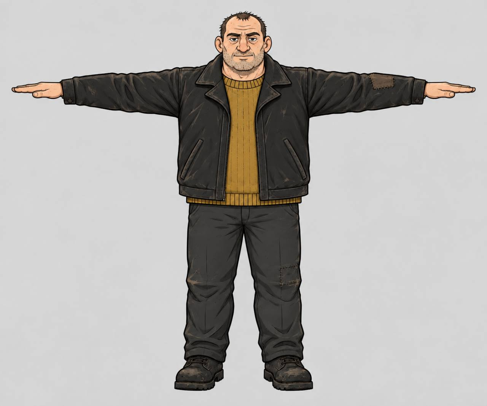
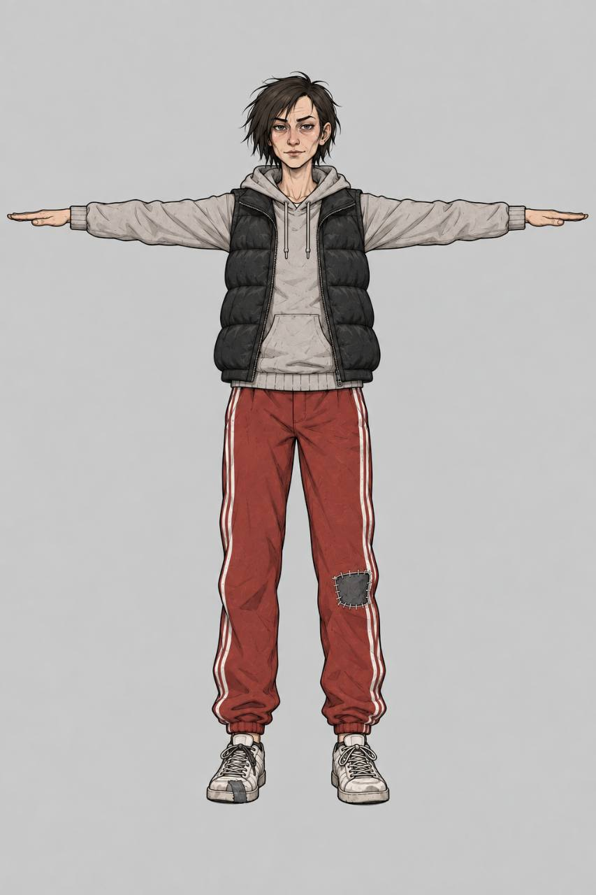

# Current fighter pilot T-poses

These are the two owner-supplied **new-pose** concepts for the Meshy fighter
pilot. Existing T-poses elsewhere in `concepts-3d/` are older work and are not
substitutes for this pair.

| ID | Source | State |
|---|---|---|
| F01 heavy bruiser | [`f01-heavy-bruiser-tpose-v01.jpg`](f01-heavy-bruiser-tpose-v01.jpg) | 2D concept approved; generated geometry awaiting owner review |
| F02 wiry skirmisher | [`f02-wiry-skirmisher-tpose-v01.jpg`](f02-wiry-skirmisher-tpose-v01.jpg) | 2D concept approved; generated geometry awaiting owner review |

## F01 heavy bruiser

## F02 wiry skirmisher

Do not treat concept approval as runtime approval. Generation task IDs,
fingerprints, Blender findings and remaining gates are recorded in
[`../../../../MESHY_PILOT_RESULTS.md`](../../../../MESHY_PILOT_RESULTS.md).
