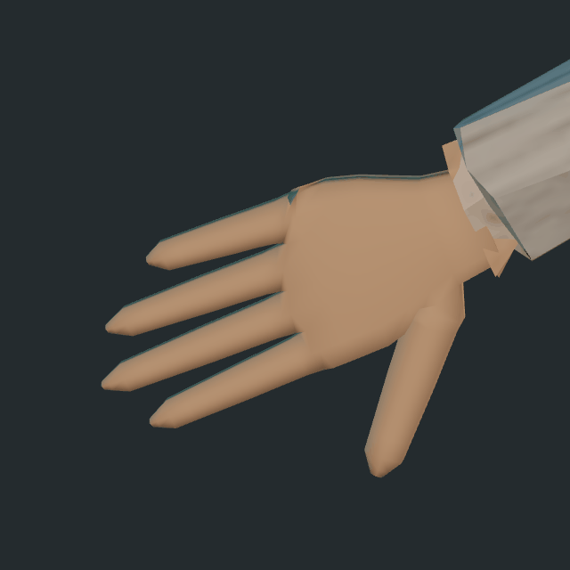
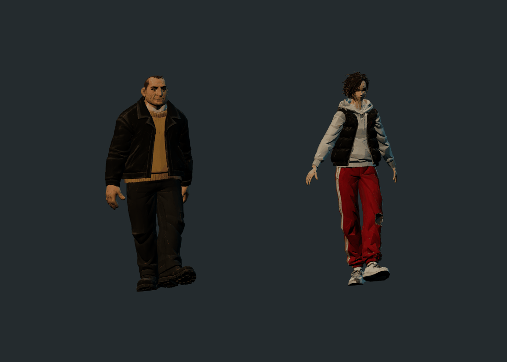
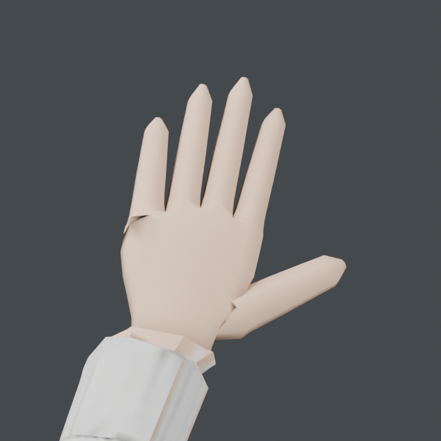
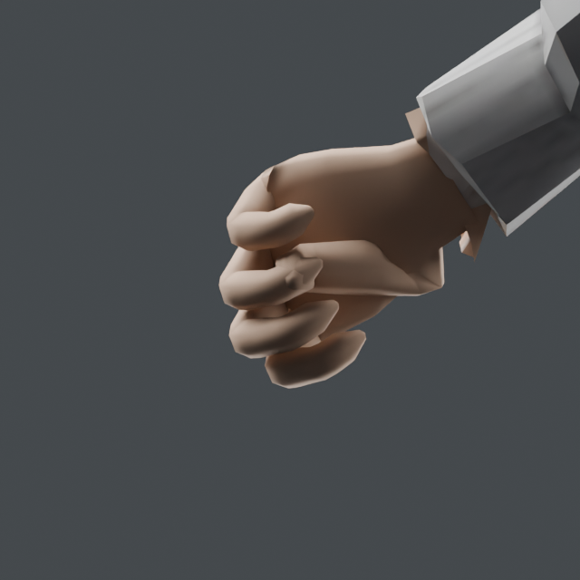
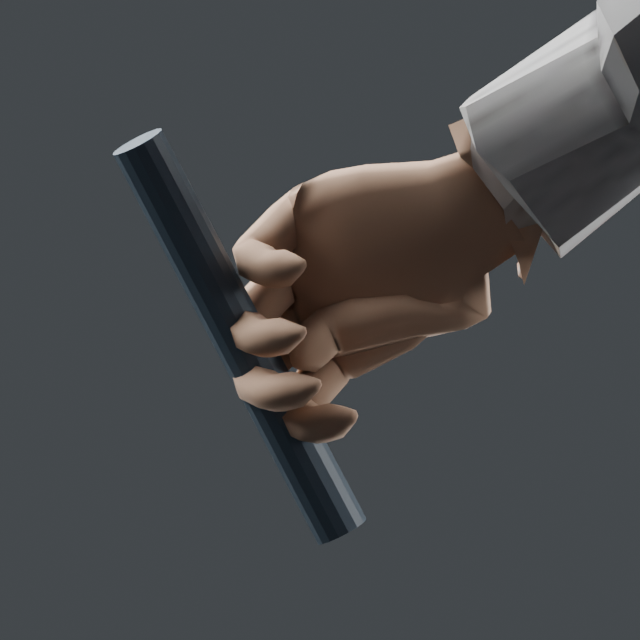
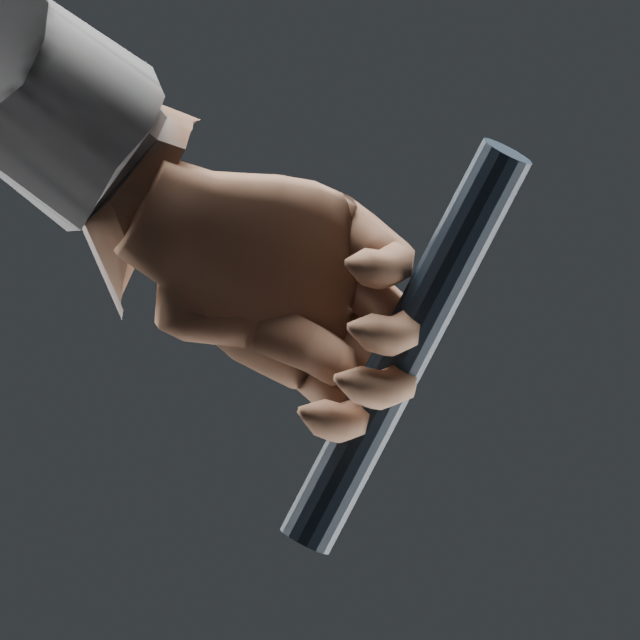

# F01 / F02 — Blender v05 review

The F02 hand geometry rejected in the v04 checkpoint has been rebuilt locally in Blender. These are downloadable **owner-review candidates**, with the previous v02 files preserved. This folder is not registered as live runtime art.

## See the result

F02 opening, closing and changing grip, rendered from the delivered GLB with Piritori's Three.js loader. A camera-facing fill light is used to make the palm readable.

Both fighters' original Casual Walk timing and identities:

| F02 open hand | F02 fist, palm side |
|---|---|
|  |  |

| Left grip | Right grip |
|---|---|
|  |  |

The cylinders are grip gauges for review, not new game props.

## Download

- [F01 combined model and three clips](f01-repaired-v05.glb)
- [F02 combined model and three clips](f02-repaired-v05.glb)
- [F01 meshless clip pack](f01-heavy-bruiser-clips-v05.glb)
- [F02 meshless clip pack](f02-wiry-skirmisher-clips-v05.glb)

On a GitHub file page, use **Download raw file**. The combined GLBs can be imported directly into Blender and played without network access. The optional clip packs contain the matching skeleton/bind information and animations without duplicated textures.

## Repair scope

- Retains the v04 arm corrections: F01 mean shoulder-to-wrist 0.575 m, F02 0.535 m. These proportions still require owner visual acceptance.
- Preserves both identities, outfits, facial/body geometry and the corrected matte skin materials.
- Retains F01's bulky hand geometry and existing hand poses.
- Rebuilds F02's palms, four fingers and thumbs as connected surfaces with geometry around the joints. Each new hand has 491 vertices and 978 triangles before joining to the body.
- Fits F02's thumb opposition for fists and a representative handle grip. The wrist positions/body rest matrices are preserved; the cuff-side surfaces remain from the source.
- Remaps the rebuilt hands to a clean patch of the existing skin albedo, avoiding old atlas seams on the new fingers. The 2K albedo image itself is unchanged from the corrected v04 texture.
- Keeps all 24 original body joints and adds 30 finger joints plus two non-weighted prop attachment joints: **56 joints total**. `grip_left` and `grip_right` are attachment bones; their local +Y runs along the handle.
- Uses bone attachments because ordinary bone-parented empties produced incorrect positions on Blender reimport. Both attachment joints are included in the numerical roundtrip test.
- Preserves the original 30 Hz, 4.0-second Alert and 4.2-second Casual Walk. The hand demonstration is a separate 3.633-second clip; it is not a new combat animation.

Total triangles: F01 **19,412**, F02 **17,254**. These are review models with 2K textures, not a claim of completed mobile optimization.

## Verified evidence

- [Asset hashes and sizes](asset-manifest.json).
- [Versioned rig signatures](rig-signatures.json), including names, parents, rest TRS and inverse-bind hashes.
- [Blender roundtrip](roundtrip-report.json): 358 frames per model, no nonfinite vertices, no separation of matching seam vertices, four skin influences maximum. Maximum joint discrepancy is approximately 0.013 mm.
- [Browser playback](browser-report.json): both models load with Piritori's exact vendored Three.js/GLTFLoader, retain clip durations and play without binding warnings or browser errors.
- [Meshless clip equivalence](clip-pack-report.json): twelve sampled poses per model match the combined GLB exactly in the browser.
- [Private archive restore](archive-report.json) and [editable scene reopen](restore-scene-report.json): hashed independent-directory restore, then offline Blender reopen with packed textures and all actions.

The Blender stills inspect the exported/reimported meshes. The GIFs use the delivered GLBs in the browser. Failed experiments and private Blender masters are not in this folder.

## Intake and remaining acceptance

Use each fighter's **own v05** clip pack. Do not treat identical joint counts or names as permission to use the other's body motion, or to combine these rest rigs with v02 clips. The different original rest poses still require a shared-body-motion retarget test.

This addresses the requested local hand rebuild and carries forward the arm/material corrections. It does not mark the entire fighter pipeline final: owner visual review, prop-specific grip fitting, full combat/transition and foot-contact acceptance, physical Pixel 10 Pro/iPad M2 testing, and off-PC private master storage remain. F01's original hand geometry remains coarse at close range.

PR #68 stays open and unmerged. No live hub files or runtime manifest entries are changed by this review package.
