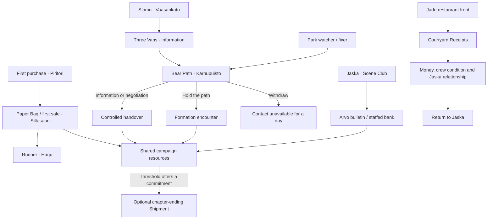

# Act I scenario atlas — Kallio 2003

Owner request, 2026-09-12: develop the game-design connections as well as visuals. This is a living index, not a new GDD, runtime content file, or claim that these scenarios are implemented in 3D. The existing GDD, design authority and authored content control facts; staging below is proposed. The owner approved the v01/v02 environmental visual direction on 2026-09-12 and requested wider battle views, possible dynamic framing, landscape testing and more scene types. Exact layouts, characters and runtime readiness are not implied. See CAMERA_AND_SCENES.md for the study and its test findings. The owner subsequently approved v03 panels 02, 03, 05 and 06 (middle/right columns) as realistic environment and framing targets; decision D008 records the source hash and panel IDs.

## Source pass and scope

Read GDD §§2–3, 9–13; DESIGN_LOCKS; MAP/UX owner additions; ACT_I_NARRATIVE; Art Bible/reference library; the content slice; and the long-term scope on `fix/godot-approach-cell`. That scope is not on main. Its original matched 3v3 start is superseded by the owner's later instruction to establish C from first principles. C.05 is a four-actor training fixture, not an integrated campaign or A/C parity result.

The current slice has 14 scheduled encounters, four mission records, two optional visits, and a chapter-ending operation. Mission records, choice effects and environment concepts are different layers. This atlas inventories them without asserting that every declared effect is executed by the current runtime.

## Connections already authored

Arrows show authored leads/effects, not mandatory errands or a replacement travel map. Slomo/Jaska visits can remain optional; Arvo is narrative-only. The shipment is the current chapter operation, not an invented boss fight. Existing content's exact values are tuning, not new art-approval decisions.

## One design packet per scenario

For each: (1) source ID and narrative purpose; (2) people and availability; (3) map anchor/approach/enterable room; (4) establishing, interaction, dialogue, tactical and aftermath views; (5) inspectable props tied to facts; (6) choices, previewed commitment and alternatives; (7) permitted escalation/withdrawal and formation footprint; (8) campaign result applied exactly once; (9) visible memory and repeat visit; (10) required assets, mobile composition and open questions.

Use the established LOOK/TALK/USE/LEAVE and contextual commitment grammar. Backgrounds cannot invent prices, interactions, geography or rewards. A lit narrative door must have an available destination. Battle cannot charge a second mission block. Similar nearby markets retain the tram-travel motivation. Keep characters and meaningful positions continuous through the face cut-ins and authored escalation.

## Mission packets — first pass

| Mission | Space and central choice | Escalation / aftermath |
|---|---|---|
| Paper Bag | Piritori collection -> Siltasaari buyer; personal delivery versus delegation, margin versus introduction | No battle in its record. Show the crowd/queue and the new lead; preserve single settlement of the first sale. |
| Three Vans | Slomo counter -> Harju observation -> return; pay for clarity, investigate or accept uncertainty | No direct battle. Good information can open Bear Path's peaceful branch; incomplete information and obligations persist. |
| Bear Path | Same park contact space becomes the confrontation; keep bear/plinth cover and withdrawal lane readable | Authored information/fixer alternatives, 2v2 if holding the path, or withdrawal and temporary contact closure. Slomo is not a fighter. |
| Courtyard Receipts | Restaurant invoice leads to the residential porttikongi; obligation, confrontation or leaving receipts | Authored record is 3v3 with negotiated/retreat outcomes and family consequences. Do not silently replace it with the C training fixture. Fix its site binding before 3D integration. |
| The Shipment (chapter operation) | Sörnäinen harbour; explicit chapter-ending commitment after its threshold | Existing stake/result/upgrade govern. Model/dress only after the approach and outcome contract are checked. No new boss or mechanics assumed. |

## Scenario catalogue

### First purchase — `enc-first-purchase`

Authored slot: day 1 / day; anchor `piritori`; site `piritori_first_buy`.

People: aatami, seller-esa.

Staging proposal: Public tram-square approach: moving crowd edges, stable meeting pool, paper offer and seller; reveal watcher/exit/crew changes on later visits.

Inspectable facts: seller's wet cuff; same watcher after two trams; price written on torn card.

Choices / declared consequences:

- **Buy one pack — €45** — Gain stock and the €68 Siltasaari demand lead; become a known customer.
- **Ask who keeps watching** — Keep cash, gain a faction lead, spend the block.
- **Walk away** — Preserve cash. The offer returns at night with a colder reception.

These are declared content consequences. Integration must verify dispatch, single settlement and reload behavior; the atlas does not certify them.

### The receipt envelope — `enc-jaska-receipt`

Authored slot: day 2 / day; anchor `makelansilta`; site `jaska_studio`.

People: aatami, jaska.

Staging proposal: Scene Club near Mäkelänsilta: entrance availability lamp, receipt city, envelope and family photo; intimate worktable framing. Courtyard event needs a separate site binding.

Inspectable facts: unfinished cardboard map; family photograph; 300 markka envelope.

Choices / declared consequences:

- **Ask before taking the envelope** — Gain dead money and preserve trust.
- **Call it family money** — Gain dead money; Jaska remembers the wording.
- **Leave the old money under the map** — Lose a bank opportunity; deepen trust.

These are declared content consequences. Integration must verify dispatch, single settlement and reload behavior; the atlas does not certify them.

### First sale — `enc-first-sale`

Authored slot: day 1 / night; anchor `siltasaari`; site `staffed_bank`.

People: aatami, buyer-leena.

Staging proposal: Siltasaari public approach and staffed-bank interior are two views of one service: outside buyer/queue, then ticket counter/mirror/notice. No illicit exchange inside the teller service.

Inspectable facts: bank queue; late SMS; southbound crowd.

Choices / declared consequences:

- **Complete the first sale** — Gain €68 and price history; the route becomes visible.
- **Trade margin for an introduction** — Gain €55 and the first runner lead.
- **Keep walking with the queue** — Preserve stock; lose the current quote.

These are declared content consequences. Integration must verify dispatch, single settlement and reload behavior; the atlas does not certify them.

### Runner at the tram stop — `enc-runner-at-tram-stop`

Authored slot: day 2 / night; anchor `harju`; site `harju_pitch`.

People: aatami, crew-slot-runner.

Staging proposal: Harju tram-stop edge: timetable, messenger bag and uninterrupted public path; recruitment is a face-to-face wage/promise decision.

Inspectable facts: creased paper timetable; repair tape on messenger bag; unanswered SMS.

Choices / declared consequences:

- **Offer €18 per night and no waiting games** — Recruit her with a clear wage and a promise she will remember.
- **Offer €10 and future work** — She joins for one job; loyalty starts low.
- **Pay €8 for the route observation** — Gain intel without recruiting.

These are declared content consequences. Integration must verify dispatch, single settlement and reload behavior; the atlas does not certify them.

### The bank counter — `enc-bank-counter`

Authored slot: day 3 / day; anchor `siltasaari`; site `staffed_bank`.

People: aatami, teller-anne.

Staging proposal: Siltasaari public approach and staffed-bank interior are two views of one service: outside buyer/queue, then ticket counter/mirror/notice. No illicit exchange inside the teller service.

Inspectable facts: number ticket; fixed conversion notice; security mirror.

Choices / declared consequences:

- **Convert all carried markka** — Receive the fixed euro equivalent; the block and visible visit are the cost.
- **Convert 120 mk** — Keep some dead money for a later family choice.
- **Leave before your number** — Keep the old cash and preserve the block's legitimacy cover only in memory.

These are declared content consequences. Integration must verify dispatch, single settlement and reload behavior; the atlas does not certify them.

### Slomo lowers his voice — `enc-toko-quiet-voice`

Authored slot: day 3 / night; anchor `vaasankatu`; site `toko_slomo_noodles`.

People: aatami, toko.

Staging proposal: Vaasankatu approach -> lit doorway -> counter. Bowl, repaired radio, tally marks and tram window carry distinct inspectable facts. Slomo stays a narrative person.

Inspectable facts: night tram through the window; three tally marks; Toko's repaired radio.

Choices / declared consequences:

- **Buy information — €120** — Confirm a safe description and unlock the Harju range.
- **Risk sabotage — €300** — 45% success is visible. Failure costs trust and may close a route.
- **Eat, listen, owe a favour** — Gain a direction rather than a quote; Toko records the favour.
- **Leave** — Keep cash; the uncertain mission remains available.

These are declared content consequences. Integration must verify dispatch, single settlement and reload behavior; the atlas does not certify them.

### The park watcher — `enc-karhupuisto-watch`

Authored slot: day 4 / day; anchor `karhupuisto`; site `karhupuisto_bench`.

People: aatami, crew-slot-watcher, dog-owner.

Staging proposal: Park approach, bench and contact, with the authored bear/plinth, readable withdrawal path and discrete cover when combat starts. The gazebo concept is mood study, not a sufficient Bear Path battle layout.

Inspectable facts: dog changing direction; empty bench kept dry; repeated crossing.

Choices / declared consequences:

- **Hire the watcher — €24 per night** — Recruit a watcher and reveal intent more clearly in the coming mission.
- **Pay €10 for the observation** — Gain one-use intent clarity without a wage.
- **Watch the dog instead** — Lower immediate pressure; enter the mission with poorer information.

These are declared content consequences. Integration must verify dispatch, single settlement and reload behavior; the atlas does not certify them.

### McCormick yard — `enc-mccormick-yard`

Authored slot: day 4 / night; anchor `linjat_yard`; site `mccormick_yard`.

People: aatami, sean-mccormick, crew-slot-muscle.

Staging proposal: Public venue -> service yard near the Linjat/Siltanen area. Family photograph, invoice and repaired equipment distinguish purchase, recruitment and obligation.

Inspectable facts: family photograph behind glass; cracked bat handle; restaurant deliveries.

Choices / declared consequences:

- **Hire the muscle — €28 per night** — Recruit muscle; owe the family no extra favour.
- **Buy the repaired bat — €35** — Unlock two-handed close pressure.
- **Take gear against a future favour** — Gain a bat and pipe; the family chooses a later obligation.
- **Keep the relationship in the public room** — No equipment; lower faction entanglement.

These are declared content consequences. Integration must verify dispatch, single settlement and reload behavior; the atlas does not certify them.

### Bear Path — `enc-bear-path`

Authored slot: day 5 / day; anchor `karhupuisto`; site `karhupuisto_bench`.

People: aatami-network-team, piritori-rival-team.

Staging proposal: Park approach, bench and contact, with the authored bear/plinth, readable withdrawal path and discrete cover when combat starts. The gazebo concept is mood study, not a sufficient Bear Path battle layout.

Inspectable facts: open withdrawal path; bear plinth cover; opponent intent if known.

Choices / declared consequences:

- **Name the empty van** — Avoid battle and complete a controlled handover.
- **Let the fixer speak** — A readable negotiation check; failure starts the 2v2 with neutral formation.
- **Hold the path** — Begin the 2v2. No death outcome; wounds and missing status are possible.
- **Leave with the package** — Fail safely; lose the contact for one day.

These are declared content consequences. Integration must verify dispatch, single settlement and reload behavior; the atlas does not certify them.

### The first firearm — `enc-first-firearm`

Authored slot: day 5 / night; anchor `piritori`; site `piritori_first_buy`.

People: aatami, seller-esa.

Staging proposal: Public tram-square approach: moving crowd edges, stable meeting pool, paper offer and seller; reveal watcher/exit/crew changes on later visits.

Inspectable facts: seller's exit glance; wrapped weight; crew reaction.

Choices / declared consequences:

- **Buy the first handgun — €180** — Unlock armed loadouts and raise Piritori pressure. It is not required to finish the slice.
- **Trade a McCormick favour** — Gain the weapon; transfer the obligation into family leverage.
- **Refuse the weapon** — Keep the money. Battle-capable means crew and preparation, not mandatory gun ownership.

These are declared content consequences. Integration must verify dispatch, single settlement and reload behavior; the atlas does not certify them.

### The restaurant front — `enc-jade-window`

Authored slot: day 6 / day; anchor `linjat_yard`; site `jade_lantern_front`.

People: aatami, mei-lan, lunch-crowd.

Staging proposal: Working restaurant first: lunch crowd, invoice and socially gated back-room door. Staff retain civilian identities; faction access is authored, not a universal enemy switch.

Inspectable facts: ordinary lunch rush; delivery invoice; closed back-room door.

Choices / declared consequences:

- **Ask about the duplicate invoice** — Reveal the courtyard recovery mission without accusing the staff.
- **Buy lunch and wait** — Spend €12; gain a rumour and preserve the relationship.
- **Push for the back room** — Open the mission faster; begin with faction distrust.
- **Leave with the lunch crowd** — Keep the teaser unresolved; the courtyard signal arrives by SMS.

These are declared content consequences. Integration must verify dispatch, single settlement and reload behavior; the atlas does not certify them.

### Courtyard last call — `enc-courtyard-last-call`

Authored slot: day 6 / night; anchor `torkkelinmaki`; site `jaska_studio`.

People: aatami-network-team, courtyard-rival-team, jaska-offscreen.

Staging proposal: Scene Club near Mäkelänsilta: entrance availability lamp, receipt city, envelope and family photo; intimate worktable framing. Courtyard event needs a separate site binding.

Inspectable facts: porttikongi withdrawal lane; lit residential windows; receipt envelope.

Choices / declared consequences:

- **Trade the Jade introduction** — Start negotiation before the 3v3; a partial account is possible.
- **Take positions** — Start the 3v3. Critical wounds are possible and telegraphed; retreat remains available.
- **Leave the receipts** — Fail the recovery without combat; protect Jaska's home and reduce pressure.

These are declared content consequences. Integration must verify dispatch, single settlement and reload behavior; the atlas does not certify them.

### What the ledger leaves — `enc-pasila-ledger`

Authored slot: day 7 / day; anchor `siltasaari`; site `staffed_bank`.

People: aatami, bank-clerk, optional-surviving-crew.

Staging proposal: Siltasaari public approach and staffed-bank interior are two views of one service: outside buyer/queue, then ticket counter/mirror/notice. No illicit exchange inside the teller service.

Inspectable facts: exit-fund total; debt demand; crew treatment needs; Pasila brochure.

Choices / declared consequences:

- **Pay debt before the exit fund** — Reduce immediate threat; Pasila remains farther away in cash.
- **Ring-fence the exit fund** — Move €120 toward Pasila; debt pressure persists.
- **Treat critical wounds first** — Prevent a known death risk; accept a weaker financial ending.
- **Ask Jaska what Eden costs** — Gain no money; unlock the honest final conversation.

These are declared content consequences. Integration must verify dispatch, single settlement and reload behavior; the atlas does not certify them.

### Jaska’s last light — `enc-jaska-last-light`

Authored slot: day 7 / night; anchor `makelansilta`; site `jaska_studio`.

People: aatami, jaska.

Staging proposal: Scene Club near Mäkelänsilta: entrance availability lamp, receipt city, envelope and family photo; intimate worktable framing. Courtyard event needs a separate site binding.

Inspectable facts: names of surviving crew; empty portrait space if someone died; unmarked Pasila cutout.

Choices / declared consequences:

- **Call the move Eden** — Close the slice with Aatami defending the plan.
- **Name what the routes cost** — Close with a harder family truth; no morality score is awarded.
- **Take Jaska's cardboard map** — Carry the Kallio network into the future literally and mechanically.
- **Leave the map unfinished** — Pasila remains a possibility rather than a victory screen.

These are declared content consequences. Integration must verify dispatch, single settlement and reload behavior; the atlas does not certify them.

### ROOM TO WORK — `visit-jaska-room-to-work`

Optional visit at `jaska_studio` after `enc-jaska-receipt`. Existing memory-only choices do not spend time blocks.

People: aatami, jaska.

Staging proposal: Scene Club near Mäkelänsilta: entrance availability lamp, receipt city, envelope and family photo; intimate worktable framing. Courtyard event needs a separate site binding.

Inspectable facts: receipt offcuts; unfinished cardboard map.

Choices / declared consequences:

- **Sit and ask about the work** — Remember that you stayed to listen. No money or time-block cost.
- **Give him room to work** — Remember that you respected his space. No money or time-block cost.

These are declared content consequences. Integration must verify dispatch, single settlement and reload behavior; the atlas does not certify them.

### AFTER SERVICE — `visit-toko-after-service`

Optional visit at `toko_slomo_noodles` after `enc-toko-quiet-voice`. Existing memory-only choices do not spend time blocks.

People: aatami, toko.

Staging proposal: Vaasankatu approach -> lit doorway -> counter. Bowl, repaired radio, tally marks and tram window carry distinct inspectable facts. Slomo stays a narrative person.

Inspectable facts: Toko's repaired radio; night tram through the window.

Choices / declared consequences:

- **Ask how the evening went** — Remember a conversation about his shop. No information or money reward.
- **Keep him company quietly** — Remember sharing a quiet moment. No information or money reward.

These are declared content consequences. Integration must verify dispatch, single settlement and reload behavior; the atlas does not certify them.

## Decision ledger and next visual review

Art direction D001 is answered, with D008 approving the wide-scene middle/right columns. On 2026-09-13 the owner delegated art/game direction and requested large leaps. Astra selected Bear Path (D003) and one battle-entry pullback followed by manual camera control (D006), with reduced-motion support. This is a documented director selection, not a claimed explicit owner choice or final runtime approval. C.07 implements the standalone encounter; see [the director packet](BEAR_PATH_DIRECTOR_PACKET.md). The existing campaign tutorial stays in order. D002, D004, D005 and D007 remain open.

Two specific gaps already found: Arvo has no authored enterable venue; `enc-courtyard-last-call` still uses `jaska_studio` despite its Torkkelinmäki schedule and mission anchor, while Jaska's studio visits now belong to Scene Club near Mäkelänsilta. Keep those physically separate until the binding is resolved. Karhupuisto's current concept gazebo cannot substitute for the authored bear/plinth and withdrawal path.

The Bear Path director packet now binds six beats to the playable scene: arrival, readable situation, information, commitment, resolution and remembered return. Automated browser checks cover these beats. Physical Pixel 10 Pro/iPad M2 playtesting, final rigs and campaign integration remain pending. Do not commission every mission's assets before this packet proves the process.

D009 (2026-09-13): the owner selected **Ink & Stone** and **Cold Street**, columns 2 and 3 of the v04 Bear Path art-direction sheet, as two alternatives. C.08 compares them on one layout without changing the camera or encounter. Amber Autumn is not selected. This direction approval does not accept final runtime assets or rigs.
