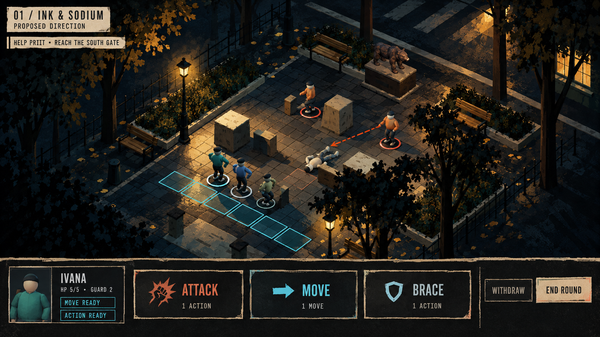
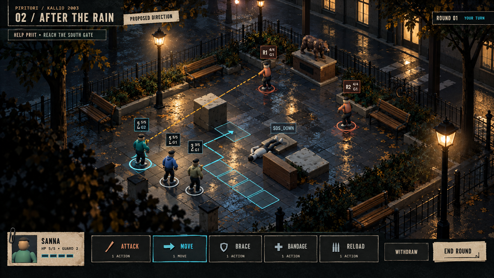

# C.13 visual exploration — proposed directions

Owner requested a summary and next steps through concept renders, 2026-09-13.
These two final review previews were made with the built-in image-generation
tool. They are **AI concept illustrations, not captures of shipped graphics**.
They are not approved production assets and do not change any asset-manifest gate.

The current C.13 scene, landscape Art Bible UI target and painted park-night
reference were supplied. ART_BIBLE.md and UX_SPEC.md remain authority. The
later Move + Act / variable-participant direction supersedes the reference's
old formation rules. Six figures in a picture are not a participant limit.

## 01 / Ink & Sodium

Broad colour and shadow shapes, strong ochre pools, matte painted surfaces,
rough paper frame edges and large labelled commands. The heavier interface
offers the clearer starting point for tactile hierarchy.

## 02 / After the Rain

Broken rough reflections, cool/warm separation, more depth around the existing
arena and a lighter command row. The visual ambition is richer material and
light response, not more elaborate character models.

## Recommendation and next implementation

Working recommendation: explore 02's environmental light with 01's stronger
command treatment. **Owner selection is pending; neither is final approval.**

1. Apply a chosen material/light treatment to the existing arena, preserving
   legal cells and cover. Use painted albedo/roughness masks, restrained probes,
   warm emissive practicals and sparse particles. Do not promise the concept's
   exact reflections or soft light as already achieved on mobile.
2. Reproduce paper edge/offset cues with scalable frames and native text. Keep
   all actual equipment commands, crew history and full intent forecasts. The
   illustrative HUD values and missing fields in these pictures are not a UI
   specification or permission to remove gameplay information.
3. Compare overview and action framing with the existing 2/6/12-person fixtures.
   Optional focus must return to the tactical overview, with foreground cutaway.
4. Review the real build on Pixel 10 Pro and iPad M2 before accepting parity.
   Keep neutral stand-ins until character-specific fit and motion gates pass.

Blender can supply bounded reusable props and material masks; scene lighting,
probes, camera, intent lines and UI belong in the engine. These previews do not
authorize new Meshy jobs or promote any rig.

Full prompt record: [PROMPTS.md](PROMPTS.md). C.13 implementation and release:
[art/UI pass](../../C13_ART_AND_UI.md), [release receipt](../../C13_RELEASE.json).
