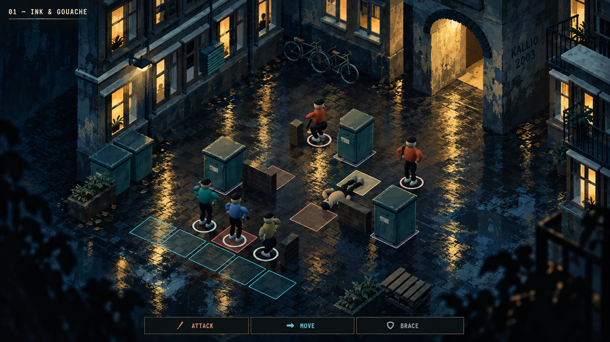
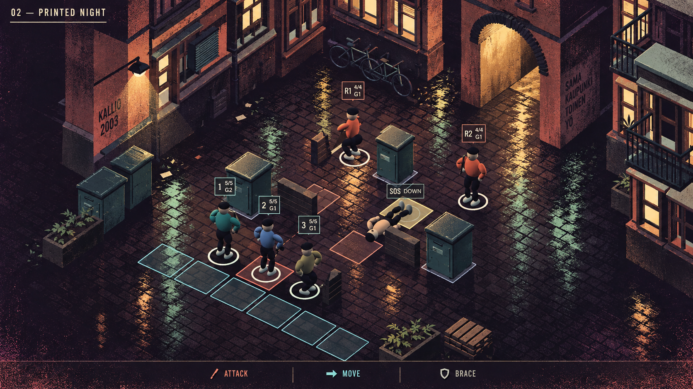
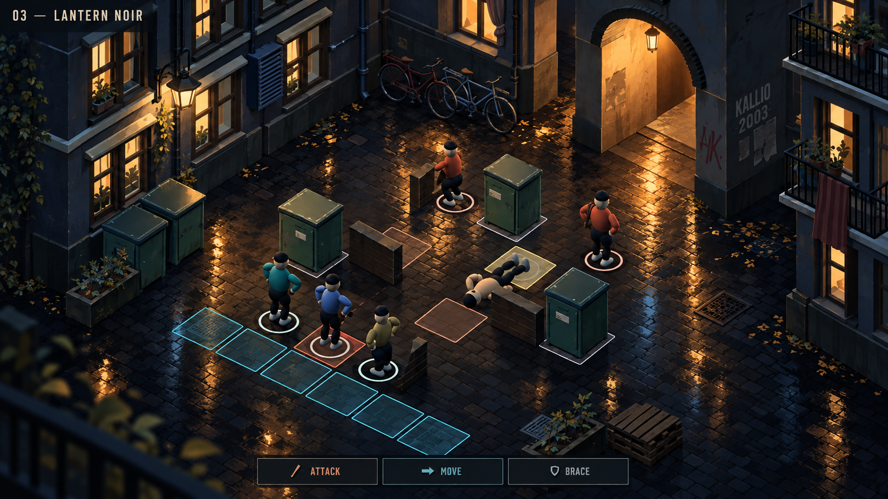
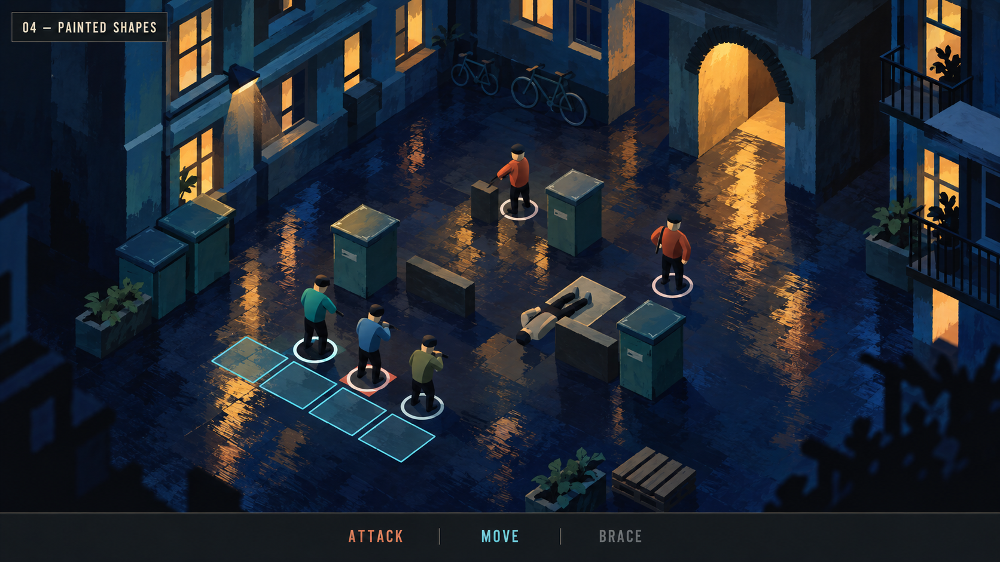
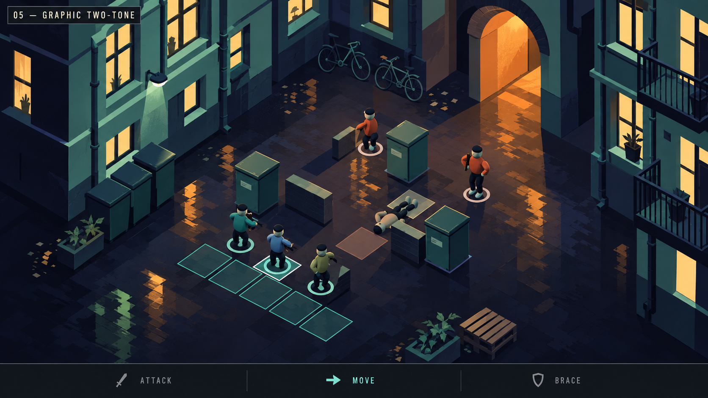
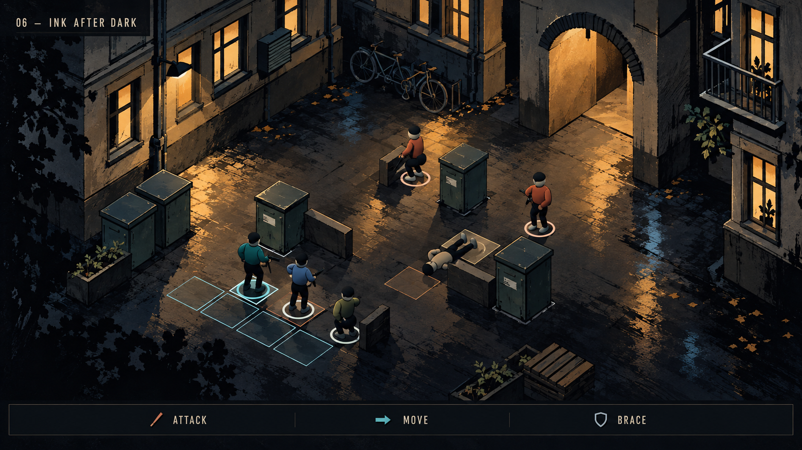

# Stylized finishes — numbered exploration

## Latest owner feedback — 2026-09-15

Current shortlist: **03 — Lantern Noir** and **06 — Ink After Dark**.
The owner first wrote “3 is best, 3 is second best”, clarified “6 second”,
then sent “6”. The last explicit ranking is 03 first / 06 second; the final
standalone number does not establish whether the ranking changed. Keep the
ranking open until clarified. These are relative preferences, not final approval.

The earlier 05 + 04 recommendation below is historical assistant advice, not
the owner’s selection. See [the complete art handoff](../../C16_ART_HANDOFF.md).
All six full-size studies and both prompt files are already in the shared
source branch. Current release: [C.16.1 evidence](../../C161_RELEASE.json).

Owner asked for more stylized concepts while mechanics are developing well.
These are generated art-direction illustrations based on the current C.16
courtyard footprint, modular geometry and deliberately simple stand-in figures.
They are not runtime captures, approved art, new campaign locations or promises
of pixel-identical rendering. They are excluded from the runtime publish list.

1. **Ink & Gouache** — broad painted cobalt/teal surfaces, warm windows, sparse
   dry ink. Implementation: painted albedos, softer material variation and light.
2. **Printed Night** — plum/coral/mint palette, simplified print-like shading and
   visible ink grain. Implementation: palette/material pass and restrained grain.
3. **Lantern Noir** — clearer painted 3D planes, selective edges, focused lantern
   lighting. Implementation: modular fixtures, painted surfaces and light falloff.

These three were made with the built-in image-generation tool. Exact prompts are
in [prompts.json](prompts.json). Generated wall lettering is illustrative and
does not become authored lore or a required asset. None changes fighter approval.

Pending owner choices: lead option; amount of visible handmade texture; light
balance. A preference selects the next exploration—it does not certify final
art. Keep the mechanics pass after the environment finish/device checks.

## Further exploration — 04–06, 2026-09-14

The owner asked for more stylization. These separate full-size studies keep
the current courtyard footprint and simple stand-ins so the comparison concerns
the rendering style. They do not propose a new arena or a six-person limit.
The 2–10+ participant brief, Kallio 2003, restrained wear and minimal UI remain.

4. **Painted Shapes** — broad blue brush planes and broken amber reflections.
   Most painterly of this set; preserve readable large shapes, reduce repeated
   fine noise in the actual material implementation.
5. **Graphic Two-Tone** — simplified mint facades, navy shadows and angular warm
   reflection marks. The clearest separation of units, cover and movement space.
6. **Ink After Dark** — muted plaster, selective ink edges and focused warm
   pools. Stronger underground mood, with a risk of excessive dark texture on
   a small screen. Keep occupied cells and fighter silhouettes clear.

Earlier art-director recommendation, **not an owner decision**: explore 05's value and
shape clarity with some of 04's broad painted marks. The figure fidelity is
deliberately the present stand-in level. The illustration's reflections, edge
quality and texture are targets to test, not promises of runtime parity.

| Component | Production route | Test before expansion |
| --- | --- | --- |
| Facades, passage and props | Existing modular Blender kit; adjust colour blocking, not unique meshes per view | Reuse in courtyard and service yard |
| Broad brush finish | Painted albedo and masks, bounded runtime texture size | Check repetition and noise at battle distance |
| Graphic shadow planes | Small Three material study with shared shader variants | Compare live light, figures and cover in three cameras |
| Wet light | Existing bounded reflection target plus painted roughness mask | Stable camera must stop captures; preserve recovery |
| Ink accents | Selective material marks or simple mesh edges first | Avoid full-screen outline cost and mobile aliasing |
| Fighters and UI | Current neutral stand-ins and compact controls | 2/6/12-person readability; no rig approval or mechanics changes |

Next: collect relative style preference; prove the chosen finish on one arena
in actual tactical, oblique, overhead and gun views; validate on Pixel 10 Pro
and iPad M2; extend the reusable treatment; then take the mechanics pass.
PR #81 and the C.16.1 follow-up #82 are now merged; the former CI blockers were
resolved. C.16.1 is the published build; physical-device and final art acceptance
remain open. See the release evidence linked above.

Exact additional prompts: [prompts-04-06.json](prompts-04-06.json). These are
generated illustrations, excluded from the runtime allowlist. The latest owner
preferences are recorded above; final approval remains open.
